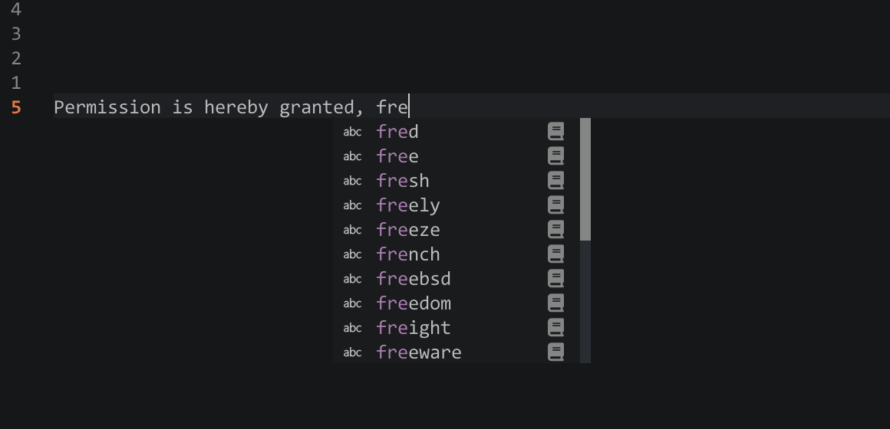

# blink-cmp-dat-word

Fast, offline word source for [blink.cmp](https://github.com/Saghen/blink.cmp).



## Features

- Fast
    - Use [Double-Array Tire](https://linux.thai.net/~thep/datrie/datrie.html) data structure to build the word completion source, with query time < 1ms.
    - After the DAT tree is built, it is saved as a binary cache file and only rebuilt when the word source file is updated.
- Async: All operations are performed asynchronously and will never block.

## Requirements

- neovim >= v0.10.0
- [blink.cmp](https://github.com/Saghen/blink.cmp)

## Quick Start

Using [lazy.nvim](https://github.com/folke/lazy.nvim)

```lua
return {
	{
		"saghen/blink.cmp",
		dependencies = {
			"xieyonn/blink-cmp-dat-word",
		},
		opts = {
			sources = {
				default = {
					-- ...
					"datword", -- add datword to default sources
				},
				providers = {
					-- add datword provider
					datword = {
						name = "DatWords",
						module = "blink-cmp-dat-word",
						opts = {
							paths = {
								-- "path_to_your_words.txt", -- You can add your owned word files.
								"/usr/share/dict/words", -- This file is included by default on Linux/macOS.
							},
						},

						-- max_items = 20, -- Maximum number of words queried per request.
						-- score_offset = -10, -- Set a lower priority.
					},
				},
			},
		},
	},
}
```

## Word Source Files

Recommends:

- `/usr/share/dict/words` is a standard system file on Unix-like OSes containing a large list of English words, one per line.
- [Google-1000-english](https://github.com/first20hours/google-10000-english) 10k most common English words.

Or add your own word list, with one word per line.
